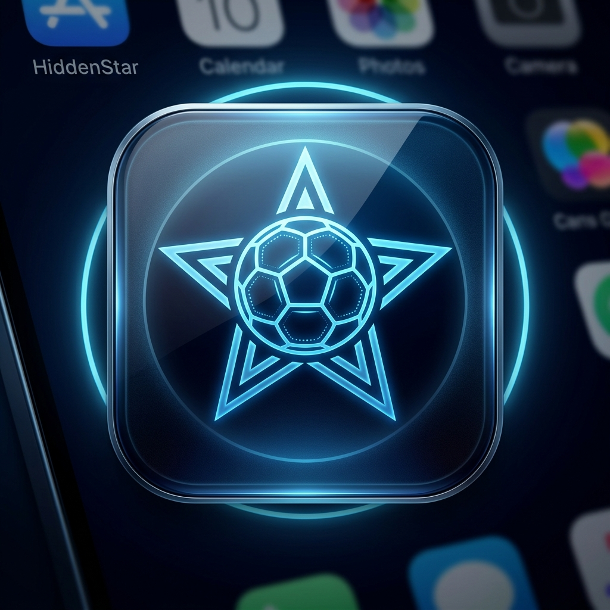
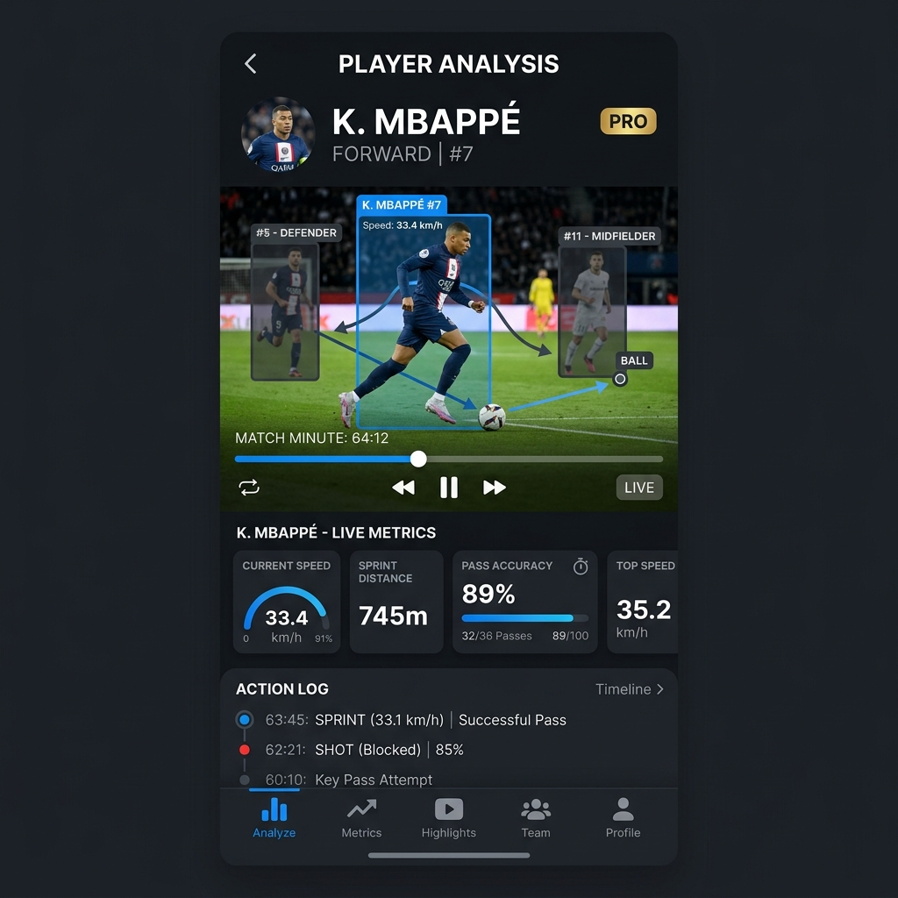
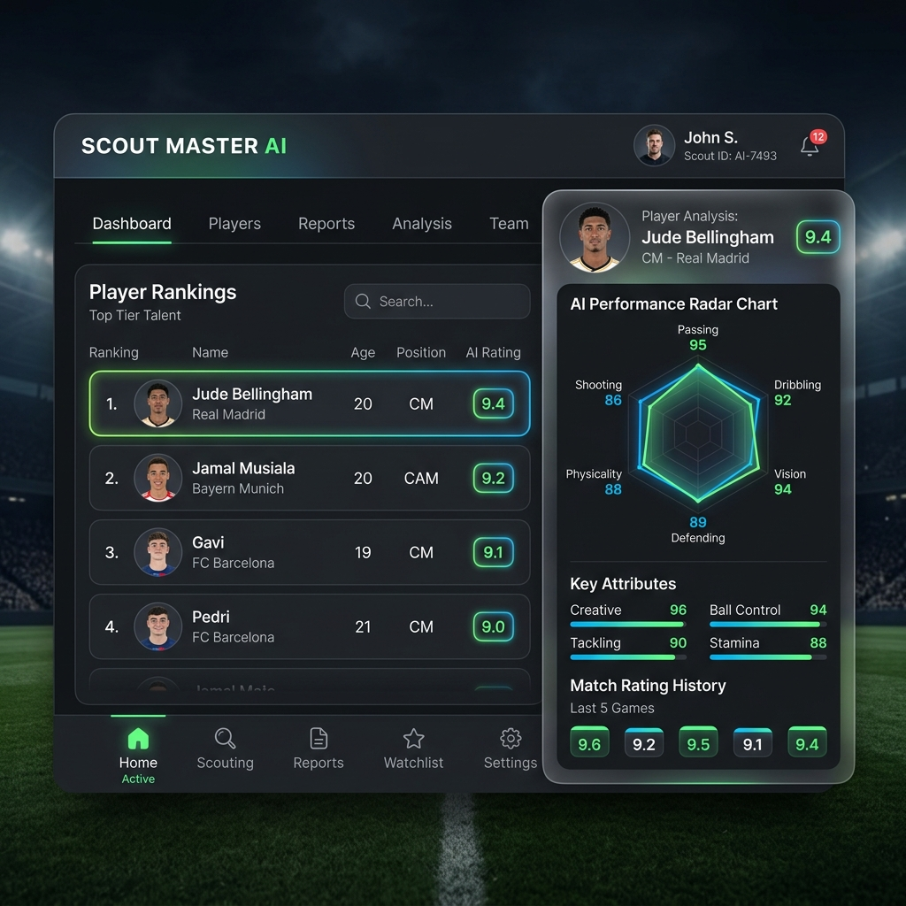

<div align="center">
  

  # ✨ HIDDENSTAR V2
  
  **AI Football Talent Detection Mobile Platform**
  
  *Democratizing football talent discovery by turning match videos into objective, data-driven player evaluations.*

  [](https://reactnative.dev/)
  [](https://expo.dev/)
  [](https://supabase.com/)
  [](https://www.typescriptlang.org/)
  [](https://fastapi.tiangolo.com/)

</div>

---

## 📱 App Preview

<div align="center">
  
  
</div>

---

## 🎯 Overview

**HiddenStar** is a mobile-first AI scouting platform built to ensure any young football player (U12–U18) anywhere in the world can be discovered based on their true performance data—not just visibility, money, or connections. 

By utilizing state-of-the-art Computer Vision (YOLOv8 + DeepSORT), HiddenStar processes standard match footage and extracts pro-level KPIs (Distance covered, Sprints, Passes, Positioning). This drastically reduces scouting costs for clubs (>70%) while providing young talents with standardized, objective scorecards.

---

## 🚀 Key Features

*   **🎥 Automated Video Analysis:** Upload standard match footage from your gallery or camera. Our background AI pipeline immediately starts processing frames.
*   **🤖 AI Detection & Tracking:** Leverages YOLOv8 and ByteTrack to identify players, track movements, and detect events like passes, shots, and dribbles.
*   **📊 Pro-Level Performance Metrics:** Instant calculation of essential KPIs including:
    *   Distance covered & Average Speed
    *   Sprint count
    *   Pass accuracy & Ball touches
*   **⭐ Global Composite Scoring:** Players receive an objective `Performance Score` based on movement, technical skills, decision making, and activity levels.
*   **🔎 Scout Dashboard:** A powerful discovery interface for recruiters to filter, rank, and compare talents by age, position, and AI ratings.
*   **🧑 Player Profiles:** Detailed digital portfolios for players showcasing match history, video highlights, and radar charts.

---

## 🧩 Tech Stack

HiddenStar is built on a highly scalable, modern microservice architecture:

### Mobile Frontend
*   **React Native (Expo CLI):** Fast, cross-platform mobile development.
*   **Zustand:** Lightweight global state management.
*   **React Query:** Server-state caching and asynchronous API requests.

### Backend Services
*   **Supabase / Node.js:** User management, authentication, and REST API.
*   **PostgreSQL:** Relational database for structured score and profile storage.
*   **AWS S3 / Cloudinary:** Robust video and media hosting.

### AI Engine (Microservice)
*   **Python (FastAPI):** High-performance backend handling video streams.
*   **PyTorch & OpenCV:** Core deep learning and computer vision frameworks.
*   **YOLOv8 & DeepSORT:** Object detection and multi-object tracking.

---

## 🛠 Quick Start (Development)

Follow these instructions to get the mobile application running on your local machine.

### Prerequisites
*   Node.js (v18+)
*   npm or yarn
*   Expo Go app on your physical device, or an iOS Simulator / Android Emulator.

### Installation

1. **Clone the repository:**
   ```bash
   git clone https://github.com/your-username/HiddenStar.git
   cd "HIDDENSTAR V2/hiddenstar-v2"
   ```

2. **Install dependencies:**
   ```bash
   npm install
   ```

3. **Start the Expo Development Server:**
   ```bash
   npm start
   ```

4. **Run on your device:**
   * Scan the QR code in your terminal using the **Expo Go** app (Android) or the native Camera app (iOS).
   * Or press `i` to open in iOS Simulator / `a` for Android Emulator.

---

## 📂 Project Structure

```text
HIDDENSTAR V2/
├── hiddenstar-v2/           # Main React Native/Expo application
│   ├── app/                 # Expo Router file-based routing
│   │   ├── (auth)/          # Authentication screens (Login, Signup)
│   │   ├── (player)/        # Player specific views (Profile, Analysis)
│   │   ├── match/           # Match and video upload flows
│   ├── components/          # Reusable UI components
│   ├── stores/              # Zustand state management
│   ├── theme/               # Colors, typography, and styling constants
│   ├── types/               # TypeScript definitions
│   └── utils/               # Helper functions
├── docs/                    # Project documentation & PRD
├── assets/                  # High-res logos and mockups
└── README.md                # You are here
```

---

## 🚀 Roadmap (MVP to V1.0)

- [x] **Phase 1:** UI, Authentication, and Video Upload structure.
- [x] **Phase 2:** Backend integration (Supabase), User Profiles.
- [ ] **Phase 3:** Basic AI pipeline (Movement tracking, Speed estimation).
- [ ] **Phase 4:** Scout Dashboard, filtering, and composite scoring implementation.
- [ ] **Future (Post-MVP):** Highlight generation, Tactical heatmaps, AI coach feedback.

---

## 🛡 License & Contact

**HiddenStar** - *Democratizing the beautiful game.*

For any business inquiries, technical questions, or scouting partnerships, please refer to the project maintainers. 

---
<p align="center">
  <i>Built with passion by the world's best full-stack developers. 🚀</i>
</p>
